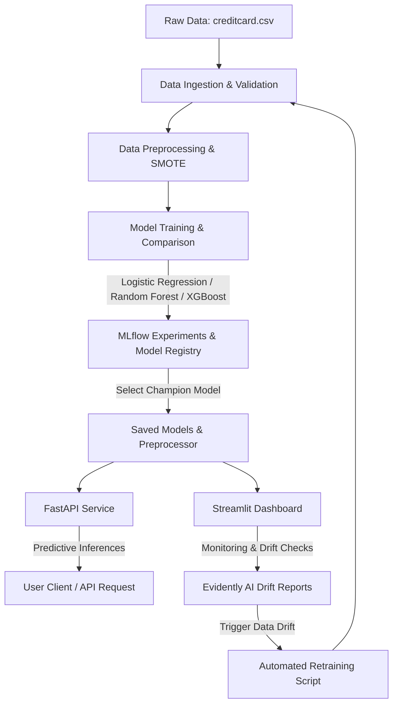

# FraudGuard: Real-Time Credit Card Fraud Detection with MLOps

FraudGuard is a production-grade, real-time credit card fraud detection system designed using industry-standard Machine Learning Operations (MLOps) principles. It leverages robust classification modeling (Logistic Regression, Random Forests, XGBoost), automated data drift monitoring using Evidently AI, and continuous experimentation tracking and model registration via MLflow. The services are fully containerized using Docker and Docker Compose.

---

## 🛠️ System Architecture

The workflow below illustrates the pipeline components from data ingestion to containerized deployment:



---

## 🗂️ Project Directory Structure

```text
FraudGuard/
├── .github/workflows/
│   └── ci.yml               # Continuous Integration (testing, linting, docker builds)
├── api/
│   └── app.py               # FastAPI web server exposing inference endpoints
├── data/
│   ├── raw/                 # Contains baseline creditcard.csv (~150MB)
│   └── processed/           # Stratified train/test splits
├── dashboard/
│   └── app.py               # Streamlit MLOps dashboard
├── logs/                    # Local component logs & Evidently HTML reports
├── models/                  # Locally saved preprocessor, best model, & metadata pkls
├── mlruns/                  # MLflow local tracking repository
├── notebooks/               # EDA and sandbox modeling
├── src/
│   ├── ingestion.py         # Data loading, validation checks, and split saving
│   ├── preprocessing.py     # Scaling (RobustScaler) & oversampling (SMOTE)
│   ├── evaluate.py          # Metric calculations & ROC / PR plot generation
│   ├── train.py             # ML model comparison and MLflow logging/registration
│   ├── predict.py           # FraudPredictor inference wrapper class
│   ├── monitoring.py        # Evidently AI data drift monitoring report generator
│   └── retrain.py           # Auto-retrainer when drift triggers
├── tests/                   # Pytest testing suites (ingestion, preproc, api)
├── Dockerfile               # Multi-service base image Docker configuration
├── docker-compose.yml       # Composed stack mapping API, Streamlit, and MLflow
├── requirements.txt         # Project requirements & dependencies
└── README.md                # System documentation
```

---

## 🚀 Installation & Local Execution

### 1. Prerequisite Local Setup
Ensure you have Python 3.11+ installed. Create and activate a virtual environment:
```bash
# Create Virtual Environment
python -m venv .venv

# Activate (Windows)
.venv\Scripts\activate

# Activate (macOS/Linux)
source .venv/bin/activate
```

Install dependencies:
```bash
pip install -r requirements.txt
```

### 2. Execute Training Pipeline Locally
Make sure you have `data/raw/creditcard.csv` in place.
```bash
# Run Data Ingestion & Splitting
python src/ingestion.py

# Run Model Training & Tracking
python src/train.py
```
This script will train Logistic Regression, Random Forest, and XGBoost models, log parameters/metrics to MLflow, and save the best performing champion model and preprocessor inside the `models/` directory.

### 3. Run FastAPI Web Service
```bash
uvicorn api.app:app --host 127.0.0.1 --port 8000 --reload
```
Interactive Swagger API documentation will be available at [http://127.0.0.1:8000/docs](http://127.0.0.1:8000/docs).

### 4. Run Streamlit Dashboard
```bash
streamlit run dashboard/app.py
```
View the dashboard at [http://localhost:8501](http://localhost:8501).

---

## 🐳 Running with Docker Compose (Recommended)

To launch the entire MLOps suite (FastAPI, Streamlit, and MLflow server) with one command:
```bash
docker-compose up --build
```

Access services at:
- **FastAPI API Documentation:** [http://localhost:8000/docs](http://localhost:8000/docs)
- **Streamlit Web Dashboard:** [http://localhost:8501](http://localhost:8501)
- **MLflow Tracking Server:** [http://localhost:5000](http://localhost:5000)

---

## 📡 API Endpoint Documentation

### 1. Health Status
* **Endpoint:** `GET /health`
* **Response:**
```json
{
  "status": "healthy",
  "timestamp": "2026-06-20T09:00:00Z",
  "service": "FraudGuard API"
}
```

### 2. Active Model Metadata
* **Endpoint:** `GET /model-info`
* **Response:**
```json
{
  "model_type": "XGBoost",
  "f1_score": 0.8923,
  "roc_auc": 0.9845,
  "precision": 0.9120,
  "recall": 0.8735,
  "accuracy": 0.9996
}
```

### 3. Single Prediction
* **Endpoint:** `POST /predict`
* **Request Payload (JSON):**
```json
{
  "Time": 406.0,
  "Amount": 239.0,
  "V1": -2.31, "V2": 1.95, "V3": -1.60, "V4": 3.99, "V5": -0.52,
  "V6": -1.42, "V7": -2.53, "V8": 1.39, "V9": -2.77, "V10": -2.77,
  "V11": 3.20, "V12": -4.09, "V13": -0.19, "V14": -4.68, "V15": -0.12,
  "V16": -2.99, "V17": -4.61, "V18": -1.46, "V19": 0.42, "V20": 0.12,
  "V21": 0.51, "V22": -0.03, "V23": -0.46, "V24": 0.38, "V25": 0.04,
  "V26": 0.10, "V27": 0.35, "V28": 0.15
}
```
* **Response:**
```json
{
  "prediction": 1,
  "probability": 0.9823,
  "risk_score": 98.23,
  "model_type": "XGBoost"
}
```

---

## 🧪 Testing and Linting

We run a local testing suite using `pytest` to validate core components:
```bash
# Execute local unit tests
pytest tests/ -v --cov=src
```
CI builds will automatically validate code lints using `flake8` and run unit tests.

---

## 🎨 Professional React Dashboard & Vercel Deployment

A high-fidelity React dashboard is available inside the [frontend/](file:///d:/FraudGuard/frontend) directory. It communicates with the Python FastAPI backend, offering a real-time transaction analyzer, batch simulation engine, MLOps metrics, drift logs, and an audit table.

### 1. Run React Dashboard Locally
To start the React frontend locally, install Node dependencies and trigger Vite's dev server:
```bash
cd frontend
npm install
npm run dev
```
Navigate to [http://localhost:5173](http://localhost:5173) in your browser. The frontend will automatically route API requests to the local FastAPI backend on [http://localhost:8000](http://localhost:8000).

### 2. Install Development & Training Dependencies
The main [requirements.txt](file:///d:/FraudGuard/requirements.txt) is optimized with minimal dependencies for lightweight production hosting. For training pipelines, notebooks, and Streamlit, install development dependencies:
```bash
pip install -r requirements-dev.txt
```

### 3. Deploy to Vercel
The repository is fully configured for Vercel out of the box using [vercel.json](file:///d:/FraudGuard/vercel.json):
- The static React dashboard compiles automatically.
- The Python FastAPI backend compiles into Vercel Serverless Functions under `@vercel/python`.
- Requests starting with `/api` rewrite to the FastAPI serverless backend.

Simply link the repository on your Vercel Dashboard, select **Vite** or **No Framework** (Vercel auto-detects Vite from `frontend/package.json` when the root is configured), and click **Deploy**.
