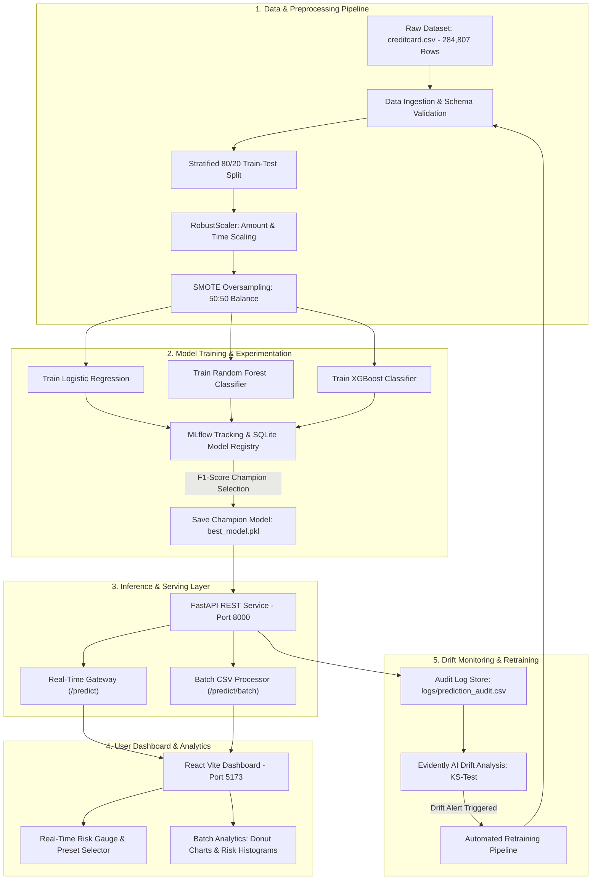

# 🛡️ FraudGuard: Enterprise Real-Time Credit Card Fraud Detection & MLOps System

[](https://www.python.org/)
[](https://fastapi.tiangolo.com/)
[](https://reactjs.org/)
[](https://mlflow.org/)
[](https://evidentlyai.com/)
[](https://vercel.com/)
[](https://www.docker.com/)

FraudGuard is an enterprise-grade, real-time Credit Card Fraud Detection and MLOps system designed using industry-standard Machine Learning Operations principles. It addresses severe class imbalance (0.17% fraud) across 284,807 transaction records using SMOTE balancing, trains multiple classifiers (Logistic Regression, Random Forest, XGBoost), tracks experiments via MLflow, serves real-time REST inferences with FastAPI, and features a custom glassmorphic React dashboard with continuous data drift monitoring via Evidently AI.

---

## 🛠️ End-to-End System Architecture



---

## 📊 Champion Model Metrics Benchmark

All models are trained on **227,845 training rows** and evaluated against **56,962 unseen testing rows** (stratified 80/20 split):

| Algorithm | Overall Accuracy | ROC-AUC | Recall (Fraud Catch Rate) | Precision | F1-Score | Status |
| :--- | :---: | :---: | :---: | :---: | :---: | :---: |
| 🏆 **Random Forest** | **`99.84%`** | **`97.55%`** | **`85.71%`** | **`52.50%`** | **`0.6512`** | **CHAMPION WINNER** |
| 🥈 **XGBoost** | `99.71%` | `97.55%` | `86.73%` | `35.71%` | `0.5060` | Runner-Up |
| 🥉 **Logistic Regression** | `97.47%` | `97.14%` | `91.84%` | `05.90%` | `0.1109` | Baseline |

---

## 🗂️ Project Directory Structure

```text
FraudGuard/
├── .github/workflows/ci.yml # Continuous Integration GitHub Action
├── api/
│   └── app.py               # FastAPI web server exposing inference endpoints
├── data/
│   ├── raw/creditcard.csv   # Raw Credit Card Fraud dataset (284,807 records)
│   └── processed/           # Stratified train.csv (80%) and test.csv (20%) splits
├── dashboard/
│   └── app.py               # Streamlit MLOps dashboard
├── frontend/                # Enterprise Vite + React Dashboard
│   ├── public/              # Static assets & sample_transactions.csv
│   ├── src/
│   │   ├── App.jsx          # Main React Dashboard (Predictor, Batch, Drift, Audit)
│   │   ├── App.css          # Glassmorphic Dark UI styles
│   │   └── index.css        # Global CSS resets
│   ├── package.json         # React dependencies
│   └── vite.config.js       # Vite bundler configuration
├── logs/                    # Audit logs & Evidently AI HTML drift reports
├── models/                  # Saved best_model.pkl, preprocessor.pkl & metadata
├── mlruns/                  # MLflow tracking repository
├── mlflow.db                # SQLite database for MLflow experiments
├── src/
│   ├── ingestion.py         # Data loading, validation, and stratified 80/20 splitting
│   ├── preprocessing.py     # RobustScaler and SMOTE oversampling
│   ├── evaluate.py          # Metrics calculation & confusion matrix generation
│   ├── train.py             # Model comparison and MLflow logging
│   ├── predict.py           # FraudPredictor inference wrapper class
│   ├── monitoring.py        # Evidently AI data drift detection
│   └── retrain.py           # Auto-retraining pipeline trigger
├── tests/                   # Pytest automated test suites
├── vercel.json              # Vercel deployment configuration
├── .vercelignore            # Vercel build exclusion rules
├── Dockerfile               # Multi-stage Docker container build
├── docker-compose.yml       # Docker Compose service orchestration
├── requirements.txt         # Production inference dependencies
├── requirements-dev.txt     # Development, training, & tracking dependencies
└── README.md                # System documentation
```

---

## 💻 Local Quickstart Guide

### 1. Environment Setup
```powershell
# Create virtual environment
python -m venv .venv

# Activate virtual environment (Windows)
.venv\Scripts\activate

# Install production and development dependencies
pip install -r requirements.txt -r requirements-dev.txt
```

### 2. Execute Data Ingestion & Model Training Pipeline
```powershell
# Step A: Ingest and split dataset (80/20 rule)
python -m src.ingestion

# Step B: Train models, log to MLflow, and save champion
python -m src.train
```

### 3. Launch Services Locally

| Service | Terminal Command | Local URL |
| :--- | :--- | :--- |
| **FastAPI Backend Service** | `uvicorn api.app:app --host 127.0.0.1 --port 8000 --reload` | **[http://localhost:8000/docs](http://localhost:8000/docs)** |
| **Enterprise React Dashboard** | `cd frontend` <br> `npm run dev` | **[http://localhost:5173](http://localhost:5173)** |
| **MLflow Tracking Server** | `mlflow ui --backend-store-uri sqlite:///mlflow.db --port 5000` | **[http://localhost:5000](http://localhost:5000)** |

---

## 🐳 Running with Docker & Docker Compose

To launch the full stack (FastAPI Backend, Streamlit Dashboard, and MLflow) using Docker:
```bash
docker-compose up --build
```
Access services:
* **FastAPI Docs**: [http://localhost:8000/docs](http://localhost:8000/docs)
* **Streamlit Dashboard**: [http://localhost:8501](http://localhost:8501)
* **MLflow Tracking UI**: [http://localhost:5000](http://localhost:5000)

---

## 🌐 Live Cloud Deployment Guides

FraudGuard supports multiple live deployment options:

### 🟢 Option A: Deploying to Render (Recommended for Docker / Full App)
Render hosts full Docker containers and Python FastAPI applications on free tiers:

1. Sign up on **[render.com](https://render.com)** using your GitHub account.
2. Click **New +** -> **Web Service**.
3. Connect your GitHub repository (`SRIKRISH-S/FraudGuard-MLOps`).
4. Select **Docker** as the runtime environment. Render will automatically detect the [Dockerfile](file:///d:/FraudGuard/Dockerfile).
5. Set the instance type to **Free** and click **Create Web Service**.
6. Render will build the container and provide a live production URL (e.g. `https://fraudguard-app.onrender.com`).

---

### ⚡ Option B: Deploying to Vercel (React Frontend + Serverless API)
The project includes a root [vercel.json](file:///d:/FraudGuard/vercel.json) and [.vercelignore](file:///d:/FraudGuard/.vercelignore) configured for Vercel:

1. Log into your **[Vercel Dashboard](https://vercel.com/dashboard)**.
2. Click **Add New** -> **Project**.
3. Import your GitHub repository (`SRIKRISH-S/FraudGuard-MLOps`).
4. Click **Deploy**. Vercel will automatically compile the static React frontend and package the FastAPI serverless functions under `@vercel/python`.
5. Access your live deployment link (e.g. `https://fraudguard-mlops.vercel.app`).

---

### 🚆 Option C: Deploying to Railway
1. Log into **[railway.app](https://railway.app)**.
2. Click **New Project** -> **Deploy from GitHub repo**.
3. Select `FraudGuard-MLOps`.
4. Railway will automatically detect `docker-compose.yml` or `Dockerfile` and provision the live environment.

---

## 📡 API Reference Documentation

### 1. Health Check (`GET /health`)
```json
{
  "status": "healthy",
  "timestamp": "2026-07-20T12:00:00Z",
  "service": "FraudGuard API"
}
```

### 2. Model Information (`GET /model-info`)
```json
{
  "model_type": "RandomForest",
  "f1_score": 0.6512,
  "roc_auc": 0.9755,
  "precision": 0.5250,
  "recall": 0.8571,
  "accuracy": 0.9984
}
```

### 3. Single Transaction Inference (`POST /predict`)
**Payload:**
```json
{
  "Time": 406.0, "Amount": 239.0,
  "V1": -2.31, "V2": 1.95, "V3": -1.60, "V4": 3.99, "V5": -0.52, "V6": -1.42,
  "V7": -2.53, "V8": 1.39, "V9": -2.77, "V10": -2.77, "V11": 3.20, "V12": -4.09,
  "V13": -0.19, "V14": -4.68, "V15": -0.12, "V16": -2.99, "V17": -4.61, "V18": -1.46,
  "V19": 0.42, "V20": 0.12, "V21": 0.51, "V22": -0.03, "V23": -0.46, "V24": 0.38,
  "V25": 0.04, "V26": 0.10, "V27": 0.35, "V28": 0.15
}
```
**Response:**
```json
{
  "prediction": 1,
  "probability": 0.8597,
  "risk_score": 85.97,
  "model_type": "RandomForest"
}
```

---

## 🧪 Testing Suite

Execute automated unit tests for preprocessors, data splitters, and FastAPI endpoints:
```powershell
python -m pytest
```
